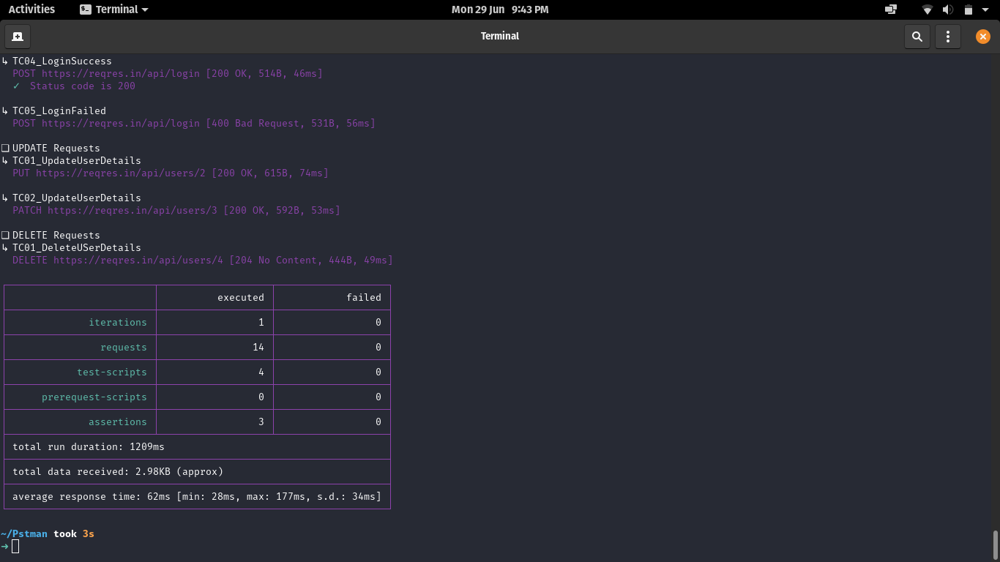

# Postman Project

## Postman 

Postman is a scalable API testing tool that can be quickly integrated into CI/CD pipeline. API stands for Application Programming Interface which allows software applications to communicate with each other via API calls.
 
## Prerequisite:

Postman (Latest version. Here Ubuntu OS is used.)

## We will use the following URL for all examples:

https://reqres.in/

## Working with requests:
- GET
- POST
- PUT
- DELETE
- PATCH

## Run the Postman Test Collection:
- Set the iteration (for e.g. 3)
- Set the Delay (for e.g.3000ms)
- Click on “Run Postman Test” button

## Test Result:

Once tests have finished, you can see the test status if it is Passed or Failed and the results per iteration.

## Run Test Collection using Terminal:

Another way to run a collection is via Newman. Newman is used for the automation.

Click [Newman](./docs/NEWMAN.md) for more information.

### Run the Test Collection:
1. change the directory to where you have saved the collection and environment.

```
$ cd /home/snehal/Postman_Tutorial
```

2. Run your collection using following command:

```
$ newman run RESTProject1.postman_collection.json -e MyWorkspace.postman_globals.json
```
